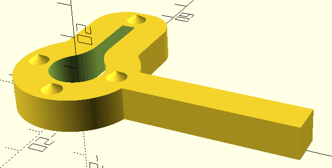

# Turntable Switch Guard

An OpenSCAD-designed protective guard for the Goldring Lenco GL75 on/off switch.

This project provides the OpenSCAD source files and STL files for 3D printing a clip around the original turntable switch so that it can be used without damaging the stylus. 

## Features

- Parametric design using OpenSCAD.
- Printable on a standard FDM 3D printer.
- Designed to fit around the existing switch.
- Source files provided so that the design can be adapted to other turntables or switch dimensions.

## Preview



*The clip in openSCAD, rendered upside down*

## Files

```text
.
├── README.md
├── LICENSE
├── src/
│   └── lencoswitchclip.scad
├── stl/
│   └── lencoswitchclip.stl
└── images/
    └── in_scad.png
```

- `src/` — OpenSCAD source files.
- `stl/` — Exported STL files ready for slicing and printing.
- `images/` — Photographs and renders of the design.

## Printing

### Recommended settings

These settings are a starting point and may need adjustment for your printer and material.

| Setting | Recommendation |
|---|---|
| Material | PLA |
| Layer height | 0.2 mm |
| Infill | 15% |
| Supports | No |
| Print orientation | Upside down, with cones on top |
| Perimeters | 5 |

**Important:** Check the fit and clearances before installing the part. The switch must remain free to operate throughout its full range of movement.

## Customisation

The design is parametric. Open `src/lencoswitchclip.scad` in [OpenSCAD](https://openscad.org/) and adjust the relevant dimensions.

The principal dimensions of the original switch are:

- Round switch section diameter: 16 mm
- Bar width: 4 mm
- Overall switch height: 40 mm
- Switch depth: 12 mm

These measurements should be checked against the actual hardware before modifying or printing the design.

## Compatibility

Designed for:

- **Turntable:** Goldring Lenco GL75

Compatibility with other models has not been established unless explicitly stated.

## Contributing

Suggestions, improvements, photographs of printed parts, and compatible adaptations are welcome.

Please open an issue or submit a merge request if you have a proposed change.

When submitting a modified design, please describe the changes and, where possible, include the updated OpenSCAD source.

## Licence

This project is released under the **CERN Open Hardware Licence Version 2 – Permissive (CERN-OHL-P-2.0)**.

Copyright © 2026 Simon Hickinbotham.

You are free to use, study, modify, manufacture, and distribute this design and products based on it, subject to the terms of the licence.

See [LICENSE](LICENSE) for the complete licence text.

## Disclaimer

This design is provided **as is**, without warranty of any kind.

Check dimensions, fit, clearances, and material suitability before use. The author accepts no responsibility for damage to equipment, injury, or other loss arising from the use of this design.

This is an independently produced design and is not affiliated with or endorsed by the turntable manufacturer.
